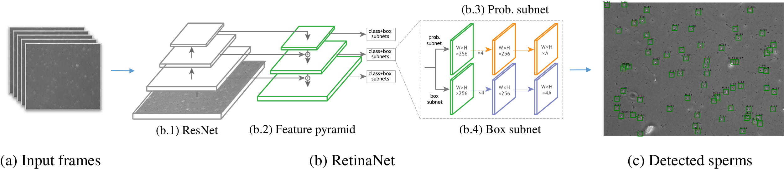
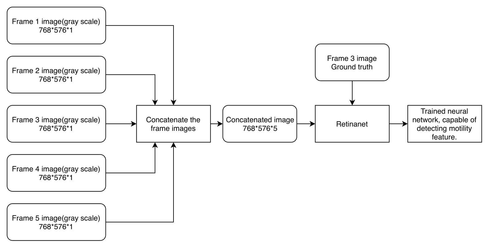
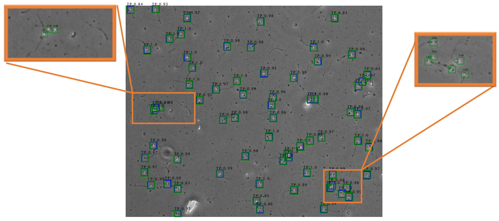

# Motile objects detection with RetinaNet
Implementation of the multi-frames detection method for motile objects (detection phase of the paper on: https://arxiv.org/abs/2002.04034)

**The tracking phase of the paper is available on** https://github.com/mr7495/Sperm_detection_and_tracking

**This repository is based on the** https://github.com/fizyr/keras-retinanet **and has been improved for motile objects detection**

The first stage of our work is detecting sperms in the frames of a video sample. We have used RetinaNet, which
is a deep fully convolutional network. As described, a deep object detector, like RetinaNet, firstly attempts to extract
object features, then, based on those features, detects the objects. Sperms are small objects with few attributes like
brightness, the special shape of head and tail, and motility. Specially, motility attribute is significant because there
might be other particles in the semen that look like sperms head and could cause false detections. Utilizing motility
attribute, the network learns to better distinguish sperms with other particles.
If we feed one frame image to the object detector, the network cannot extract the motility attribute. Our method is to
feed the concatenation of consecutive frames of video samples to the network so that it can extract motility attributes.
The result reported in Section 4 illustrates the superiority of our proposed method. While training the network, we feed
a concatenation of several frames and the ground-truth of the middle frame to the network. Fig. 2, is an example of
feeding a concatenation of five consecutive frames with the ground-truth of the middle frame to the network. This
way makes the network able to detect the sperm movement from previous and next frames and consider the motility
attribute.
For testing the object detector, we concatenate each frame with its previous and next frames of the video. It is noteworthy,
that when the next frames or previous frames of the selected frame are not available (e.g., first or last frames of the
video), we repeat the nearest frame instead of those unavailable frames.

	
	 
	<em>General schematic of the detection phase</em>

	
	 
	<em>An example for concatenating five consecutive frames</em>

	
	 
	<em>An example of a detected image</em>

These next figures show the different evaluation metrics for concatenation of the different number of frames:

The code has been tested on video samples with 25 frames and the sample of used annotations has been shared in annotation sample.csv file.
If you have more than 25 frames or want to use different type of annotation file change load-image function in keras_retinanet/preprocessing/csv_generator.py address.

In this code 3 consecutive frames have been concatenated to be used as the input of RetinaNet.

If you want to use more than 3 consecutive frames you have to apply some changes in these files:

1-resnet_retinanet function in keras_retinanet/models/resnet.py (change first layer shape)

2-load_image function in keras_retinanet/preprocessing/csv_generator.py (change the code to load more than 3 consecutive frames.)

3-keras_retinanet/utils/eval.py ( This line: image1 = generator.load_image(i)[:,:,1].astype(np.uint8),1 is the middle frame when we have 3 consecutive frames.)

4-preprocess_image function in keras_retinanet/utils/image.py

The code for training and testing and three consecutive frames for testing and the result of it has also been shared on this repository.

Our trained neural network based on 3 concatenated frames have been shared on: https://drive.google.com/open?id=1pN3A-tWJOphRdTZ7cPhJTnTIhoiGrcWv

The idea is from paper https://arxiv.org/abs/2002.04034.

Cite as 	arXiv:2002.04034

Developer Email: mr7495@yahoo.com
